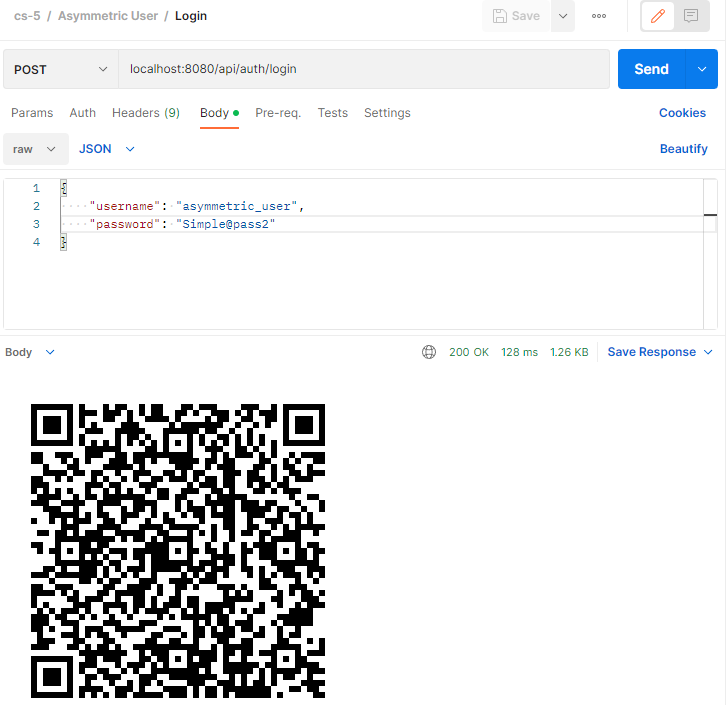

# Topic: Web Authentication & Authorisation.

### Course: Cryptography & Security
### Author: Mocanu Liviu

----

## Overview

&ensp;&ensp;&ensp; Authentication & authorization are 2 of the main security goals of IT systems and should not be used interchangibly. Simply put, during authentication the system verifies the identity of a user or service, and during authorization the system checks the access rights, optionally based on a given user role.

&ensp;&ensp;&ensp; There are multiple types of authentication based on the implementation mechanism or the data provided by the user. Some usual ones would be the following:
- Based on credentials (Username/Password);
- Multi-Factor Authentication (2FA, MFA);
- Based on digital certificates;
- Based on biometrics;
- Based on tokens.

&ensp;&ensp;&ensp; Regarding authorization, the most popular mechanisms are the following:
- Role Based Access Control (RBAC): Base on the role of a user;
- Attribute Based Access Control (ABAC): Based on a characteristic/attribute of a user.


## Objectives:
1. Take what you have at the moment from previous laboratory works and put it in a web service / serveral web services.
2. Your services should have implemented basic authentication and MFA (the authentication factors of your choice).
3. Your web app needs to simulate user authorization and the way you authorise user is also a choice that needs to be done by you.
4. As services that your application could provide, you could use the classical ciphers. Basically the user would like to get access and use the classical ciphers, but they need to authenticate and be authorized.

## Implementation:
2FA was implemented with TOTP using QR and JWT as Bearer Token.
### User

There are two roles for the authenticated users, CLASSIC to use Classic ciphers and ASYMMETRIC for the asymmetric counterpart. A user having a ASYMMETRIC role couldn't access classic ciphers and vice versa.
```java
public enum ERole {
    CLASSIC, ASYMMETRIC
}
```
We will describe in more detail below.
In order for these to exist in the database, we need to do the following query:
```sql
INSERT INTO roles(name) VALUES('CLASSIC');
INSERT INTO roles(name) VALUES('ASYMMETRIC');
```
Thus we ensured that the roles exist in db.

A user sends their username, email, password and role as the registration request, thus these are their private fields.
```java
public record RegisterRequest(String username, String email, String password, Set<String> role) {
}
```
By commenting out the validation and entity setup, this is the user class:
```java
public class User {
    //...
    private Long id;

    //validations...
    private String username;

    //validations...
    private String email;

    //validations...
    private String password;

    //...
    private Set<Role> roles = new HashSet<>();

    private String secret;
    
    //other logic
}
```

### Web Service
The web service is implemented using *Spring Boot* framework.

For user registration we have the endpoint `api/auth/register`, that requires a RegisterRequest like the one we saw above.

```java
@RestController
@RequestMapping("/api/auth")
//...
public class AuthController {
    private final AuthService authService;

    @PostMapping("/register")
    @ResponseStatus(HttpStatus.CREATED)
    public void registerUser(@Valid @RequestBody RegisterRequest registerRequest) {
        authService.register(registerRequest);
    }
    //...
}
```

When registering a user we first check if there already exists a user with these credentials, then we encode the password and save them in the database with the correct roles.

```java
@Service
@RequiredArgsConstructor
//...
public class AuthService {
    //...
    
    public void register(RegisterRequest registerRequest) {
        if (userService.existsByUsername(registerRequest.username())) {
            throw new AuthException("Error: Username is already taken!");
        }

        if (userService.existsByEmail(registerRequest.email())) {
            throw new AuthException("Error: Email is already in use!");
        }

        // Create new user's account
        User user = new User(registerRequest.username(),
                registerRequest.email(),
                encoder.encode(registerRequest.password()));

        //set roles...
    }
    
    //...
}
```

To log in we use the `api/auth/login` endpoint which takes in a LoginRequest (username and password) and creates a png image as the qr code if the user introduced their credentials correctly. 

```java
@RestController
@RequestMapping("/api/auth")
//...
public class AuthController {
    private final AuthService authService;

    @PostMapping(
            value = "/login",
            produces = MediaType.IMAGE_PNG_VALUE
    )
    public @ResponseBody byte[] createQrAfterLogging(@Valid @RequestBody LoginRequest loginRequest) {
        return authService.login(loginRequest);
    }
    //...
}
```
### TOTP
We generate the user's secret (for QR) if the authentication was successful.
```java
@Service
@RequiredArgsConstructor
//...
public class AuthService {
    //...
    public byte[] login(LoginRequest loginRequest) {
        //verify credentials
        Authentication authentication = this.authenticationManager.authenticate(
                new UsernamePasswordAuthenticationToken(loginRequest.username(), loginRequest.password()));

        sc.setAuthentication(authentication);

        UserDetailsImpl userDetails = (UserDetailsImpl) authentication.getPrincipal();
        //generate secret for qr if credentials passed
        String secret = mfaService.generateSecret();
        //and save the secret for the user
        userService.save(
                userService.findByUsername(userDetails.getUsername()).setSecret(secret)
        );

        //generate qr for their secret with their email
        return mfaService.generateQrPng(secret, userDetails.getEmail());
    }

    //...
}
```
Let's assume we made a valid request and with the right credentials, the response would be something resembling the image below (but the qr will differ):

Otherwise, we'll get a 401 Unauthorized error.

After scanning the QR code with any Authenticator app like Google Authenticator, we'll get a TOTP that has to be inserted in the `api/auth/confirm-with-mfa` endpoint which uses `@RequestParam code`.
If the code is incorrect, user can try again. 
```java
@Service
@RequiredArgsConstructor
//...
public class AuthService {
    //...
    public ResponseEntity<?> confirm(String code) {
        //...
        if (mfaService.verify(currentUser.getSecret(), code)) {
            String jwt = jwtUtils.generateJwtToken(sc.getAuthentication());

            return ResponseEntity.ok(new JwtResponse(jwt));
        }

        throw new AuthException("The Code is incorrect.");
    }

    //...
}
```
If the code is right however, a jwt will be generated for the user, but more on that in a second.


The generation for the QR takes place in the mfaService:
```java
@Service
public class MfaService {
    //generating a secret for the user
    public String generateSecret(){
        //...
    }

    //creation of qr data using different paramenters such as how many digits does the code have, and it's validity period.
    private QrData generateQrData(String secret, String email){
        return new QrData.Builder()
                .label(email)
                //user's secret
                .secret(secret)
                .issuer("CsLabsMFA")
                .algorithm(HashingAlgorithm.SHA256)
                .digits(6)
                .period(30)
                .build();
    }

    //conversion of data to png
    public byte[] generateQrPng(String secret, String email){
        //...
    }

    //verify whether the input matches the actual code
    public boolean verify(String secret, String code){
        TimeProvider timeProvider = new SystemTimeProvider();
        CodeGenerator codeGenerator = new DefaultCodeGenerator();
        CodeVerifier verifier = new DefaultCodeVerifier(codeGenerator, timeProvider);

        return verifier.isValidCode(secret, code);
    }
}
```
As we previously mentioned, if the code is correct, the user will receive a JwtResponse with the newly created jwt `accessToken`.
```java
public record JwtResponse(@NotNull String accessToken) {
}
```
### JWT

The JWT token is generated using *Spring Security* with SignatureAlgorithm.HS512 and jwtSecret. The jwtSecret and jwtExpirationMs are injected from application.properties.

```java
@Component
public class JwtUtils {
    //...
    
    @Value("${cslabs.app.jwtSecret}")
    private String jwtSecret;

    @Value("${cslabs.app.jwtExpirationMs}")
    private int jwtExpirationMs;

    public String generateJwtToken(Authentication authentication) {

        UserDetailsImpl userPrincipal = (UserDetailsImpl) authentication.getPrincipal();

        return Jwts.builder()
                .setSubject((userPrincipal.getUsername()))
                .setIssuedAt(new Date())
                .setExpiration(new Date((new Date()).getTime() + jwtExpirationMs))
                .signWith(SignatureAlgorithm.HS512, jwtSecret)
                .compact();
    }

    //...
}
```
### Authentication
The authentication was implemented using the above-mentioned Jwt as a Bearer Token, and as we also saw, it is impossible to get one unless going through the *TOTP process* successfully, with valid credentials. 


Without the JWT, there is no way for the user to further access any resources as we can see in the *WebSecurityConfig*:
```java
@Configuration
@EnableWebSecurity
@EnableGlobalMethodSecurity(prePostEnabled = true)
@RequiredArgsConstructor
public class WebSecurityConfig extends WebSecurityConfigurerAdapter {
    //...

    @Override
    protected void configure(HttpSecurity http) throws Exception {
        http.cors().and().csrf().disable()
                .exceptionHandling().authenticationEntryPoint(unauthorizedHandler).and()
                .sessionManagement().sessionCreationPolicy(SessionCreationPolicy.STATELESS).and()
                .authorizeRequests()
                //the only endpoints allowed without a jwt are registration and login from /auth.
                .antMatchers("/api/auth/**").permitAll()
                .anyRequest().authenticated();

        http.addFilterBefore(authenticationJwtTokenFilter(), UsernamePasswordAuthenticationFilter.class);
        http.headers().frameOptions().disable();
    }
}
```

### Authorization
The authorization is implemented by using `@PreAuthorize("hasAuthority('ROLE')")` where ROLE is one of the above-mentioned, thus checking whether the user is allowed to access a certain resource:

```java
@RestController
@RequestMapping("/api/cipher")
@RequiredArgsConstructor
public class CipherController {
    private final CipherService cipherService;

    @GetMapping("/caesar")
    @PreAuthorize("hasAuthority('CLASSIC')")
    @ResponseStatus(HttpStatus.OK)
    public CipherResponse caesarCipher(@RequestParam String message, @RequestParam int shift) {
        return cipherService.caesar(message, shift);
    }

    @GetMapping("/rsa")
    @PreAuthorize("hasAuthority('ASYMMETRIC')")
    @ResponseStatus(HttpStatus.OK)
    public CipherResponse asymmetricCipher(@RequestParam String message) {
        return cipherService.asymmetric(message);
    }
}
```
To achieve said step however, the user still needs to possess the valid jwt token and used it in the Auth tab as a Bearer Token. Otherwise the user will be prompted a 403 Forbidden Error.

## Conclusion

In this laboratory work we implemented a RESTful API secured using Spring Security with JWT tokens as Bearer Token and 2fa with TOTP using QR codes. We also authorize users depending on what role they possess, allowing them only a certain resource (either Classic ciphers or Asymmetric ciphers) to encrypt a message. This has been a unique experience to learn more about the interesting security aspects of the applications.